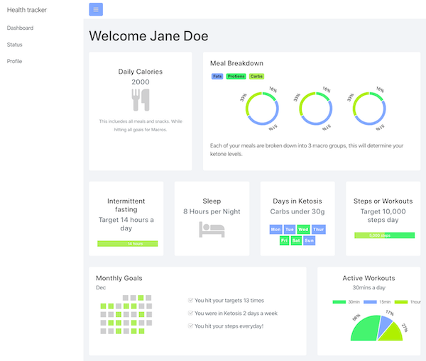

# Dashboard
This project was bootstrapped with [Create React App](https://github.com/facebook/create-react-app).

## Overview
This dashboard is my current project. I am working on connecting the Node server to my Mongo database. (This can be found in a seperate repository [Dashboard-Backend](https://github.com/adiaguidry/dashboard-backend).

I also pulled in charts js to showcase the data in a fun and creative way.

The layout was built on Bootstaps Dashboard template.

There data is pull into the frontend React componets. I used hooks to manipulate the data and update the UI

Currently live on Heroku: [Dashboard-live](https://guarded-refuge-33074.herokuapp.com/)

